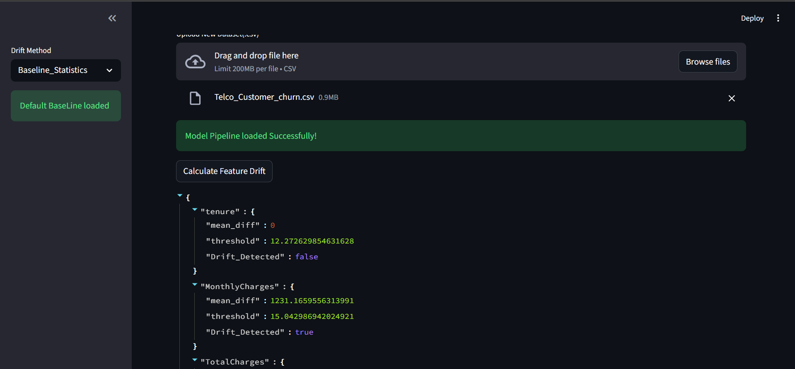
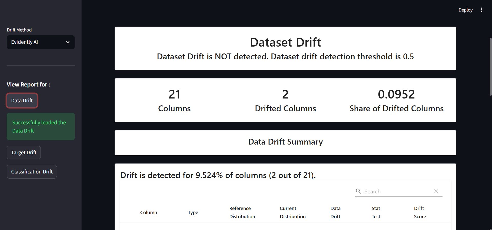

# ML Model Drift Detection & Performance Monitoring System

🚀 Production-style ML monitoring system with Streamlit dashboard and Evidently AI integration.

## 🔍 Overview
This project simulates a production ML monitoring system that detects data drift, prediction drift, and model performance degradation on new incoming datasets.


The system compares new data distributions against baseline training statistics and flags potential risks to model reliability.

---

## ✨ Features

- Detects **Feature Drift** using baseline statistics
- Detects **Prediction Drift** using prediction distribution comparison
- Detects **Target Drift & Model Performance Drift** using Evidently AI
- Interactive **Streamlit Dashboard**
- Supports **real-time CSV upload**
- Shows **visual HTML reports** for detailed drift analysis
- Provides **Model Health Status** (STABLE / MONITOR / HIGH RISK)

---

## 📸 Dashboard Preview

### Baseline Statistics Drift Detection


### Evidently AI Data Drift Report


---

## ⚙️ Tech Stack
- Python
- Scikit-learn
- Pandas
- NumPy
- Streamlit
- Joblib
- Evidently AI

---

## Project Architecture
```text 
User Upload CSV
      ↓
Load Saved Pipeline
      ↓
Generate Predictions
      ↓
Drift Detection
  ├─ Baseline Math
  └─ Evidently AI
      ↓
Streamlit Dashboard

```
---

## 🧠 Key Concepts Implemented
- Feature Drift Detection (mean shift vs baseline standard deviation)
- Prediction Drift Detection (positive-rate distribution change)
- ML Pipeline with ColumnTransformer
- Baseline statistics persistence
- Model health status classification (STABLE / MONITOR / HIGH RISK)

---

## 🚀 How It Works
1. Train the ML model and save:
   - Model pipeline
   - Baseline feature statistics
   - Baseline prediction distribution
2. Upload a new dataset via Streamlit
3. System computes:
   - Feature-level drift
   - Prediction drift
4. Model health status is reported as:
   - **STABLE**
   - **MONITOR**
   - **HIGH RISK**

---

## 📦 Saved Artifacts

The system saves the following artifacts after training:

- model_pipeline.pkl → trained ML pipeline
- baseline_stats.pkl → baseline feature statistics
- baseline_positive_rate.pkl → baseline prediction distribution

These are used for real-time drift comparison.

---


## Project Structure
```text

ML-DATA-DRIFT-MONITORING-PROJECT/
│
├── app.py
├── requirements.txt
├── readme.md
├── .gitignore
│
├── artifacts/
│   ├── model_pipeline.pkl
│   ├── baseline_stats.pkl
│   └── baseline_positive_rate.pkl
│
├── src/
│   ├── __init__.py
│   ├── baseline_statistics.py
│   ├── drift_utils.py
│   ├── model_utils.py
│   └── evidently_reports.py
│
├── reports/
│   ├── data_drift.html
│   ├── target_drift.html
│   └── classification_drift.html
│
├── data/
│   └── Telco_Customer_churn.csv
│
├── notebooks/
│   └── model_training.ipynb

```
---

## ▶️ Run the Application
```bash
pip install -r requirements.txt
streamlit run app.py
```
---

## 📋 Requirements

Python 3.11
Streamlit
Scikit-learn
Pandas
NumPy
Evidently AI
Joblib

---